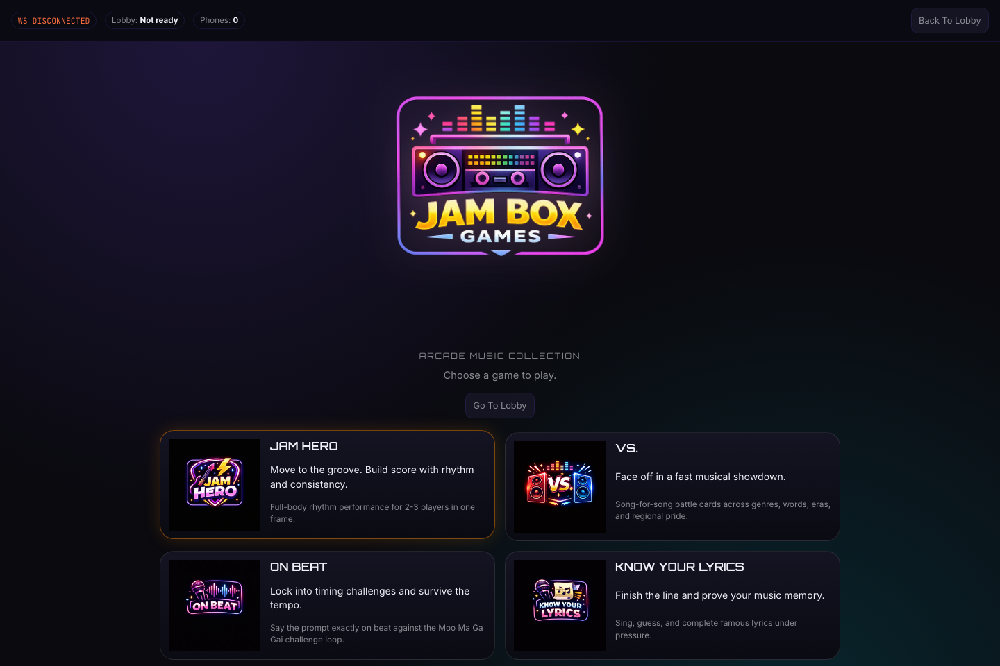
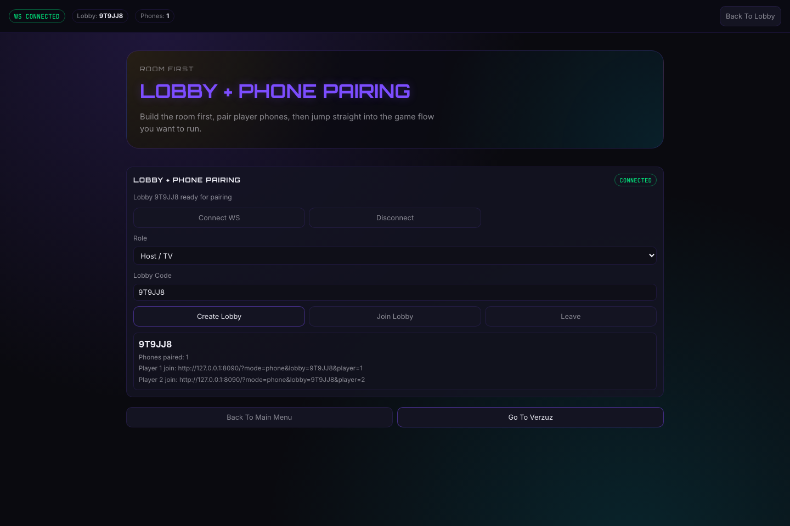
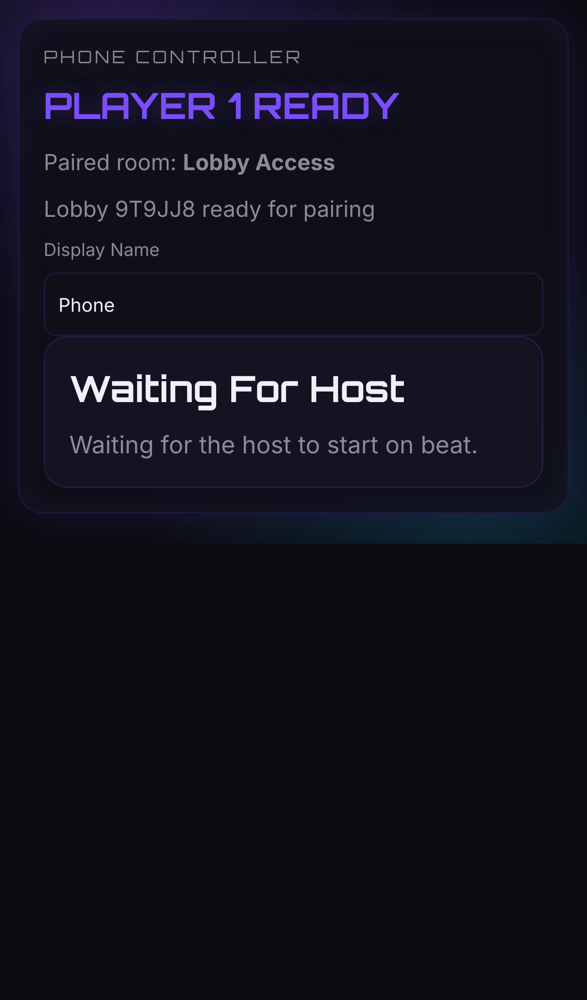
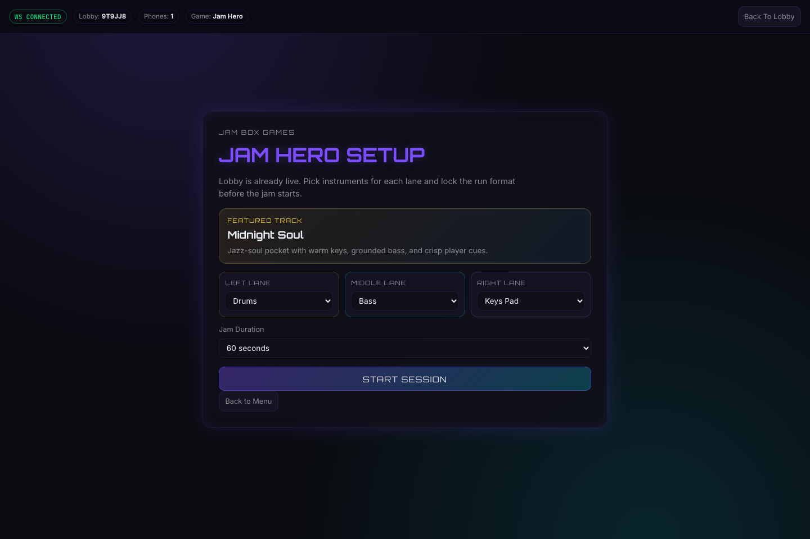
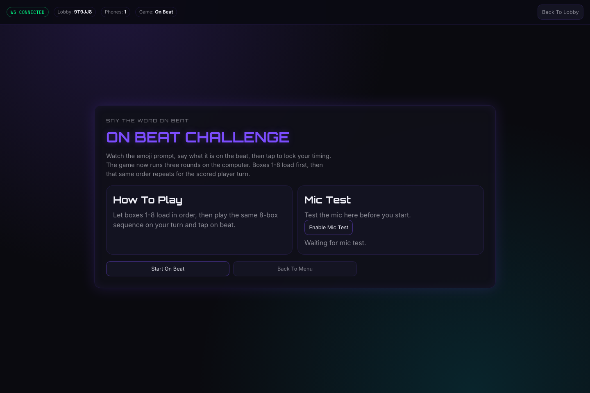
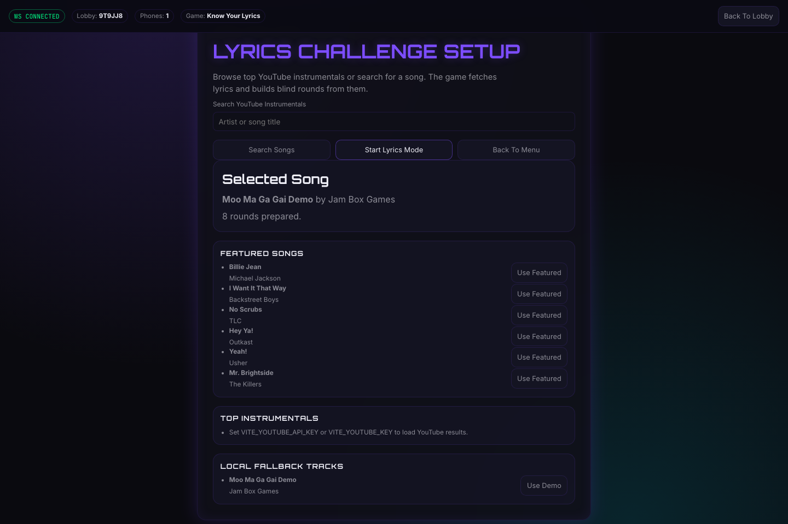

<p align="center">
  
</p>

<h1 align="center">Jam Box Games</h1>

<p align="center">
  A local-first music party arcade: run the host on a laptop or TV, pair player phones,
  and jump into rhythm, battle, and lyric games.
</p>



## The experience

Jam Box Games is designed for a room, not a solo browser tab. The host screen runs the lobby and game, while phones join as private controllers and microphone inputs over the same network.

`Host screen → create lobby → pair phones → choose a game → play together`

<table>
  <tr>
    <td width="66%">
      
    </td>
    <td width="34%">
      
    </td>
  </tr>
</table>

1. Open the lobby on the host and select **Connect WS**.
2. Select **Create Lobby**, then open a displayed player link on a phone.
3. Return to the main menu and choose a game. Phone controls update with the round.

## Four playable modes

| Mode | How it plays |
| --- | --- |
| **Jam Hero** | Two or three players move in one camera frame to perform drum, bass, and pad parts. Pose tracking turns motion into quantized musical events. |
| **Vs.** | Two players build Spotify queues and face off song-for-song across themed battle cards. |
| **On Beat** | Players say the prompted word into their phones and score by landing it on the beat. |
| **Know Your Lyrics** | Players complete lyric lines against timed cues, with automatic or manual transcription. |

<table>
  <tr>
    <td></td>
    <td></td>
  </tr>
  <tr>
    <td align="center"><strong>Full-body rhythm play</strong></td>
    <td align="center"><strong>Phone-powered timing challenges</strong></td>
  </tr>
</table>



## Run it locally

Requirements: Node.js 20+, pnpm, and a current Chromium-based browser.

```bash
pnpm install --frozen-lockfile
pnpm dev
```

Open the Vite URL shown in the terminal, normally `http://localhost:5173`. `pnpm dev` starts both the web app and its WebSocket lobby server.

To pair real phones, put them on the host's network and open the LAN URL printed by Vite. Camera and microphone access on a non-`localhost` phone URL may require a trusted HTTPS origin; a local tunnel is the simplest option.

For a production-style local run:

```bash
pnpm build
pnpm start
```

The built app and WebSocket endpoint are served together on `http://localhost:8080` by default.

## Optional service setup

The core app, lobby, Jam Hero, local On Beat audio, and bundled lyric demo work locally. These variables unlock external services:

| Variable | Enables |
| --- | --- |
| `VITE_SPOTIFY_CLIENT_ID` | Spotify sign-in and queue management for Vs. |
| `VITE_SPOTIFY_REDIRECT_URI` | Custom Spotify callback/app origin when needed |
| `VITE_YOUTUBE_API_KEY` | YouTube instrumental search in Know Your Lyrics (`VITE_YOUTUBE_KEY` is also accepted) |
| `OPENAI_API_KEY` | Server-side microphone transcription for On Beat and Know Your Lyrics |
| `OPENAI_TRANSCRIPTION_MODEL` | Optional transcription-model override; defaults to `gpt-4o-mini-transcribe` |
| `VITE_WS_URL` | Custom WebSocket endpoint; normally leave unset so `/ws` uses the app origin |

Put local values in `.env.local`. Do not commit credentials.

## Jam Hero demo setup

- Use the latest Chrome or Edge with camera permission enabled.
- Frame two or three people from roughly shoulders to knees.
- Stand about 1.8–3 metres from a centered camera in bright, front-facing light.
- Start a session, grant camera/audio access, then complete or skip calibration.
- Stay in the left, middle, or right lane and move to trigger its instrument.

Jam Hero uses TensorFlow.js MoveNet MultiPose, Tone.js, deterministic in-key accompaniment, zone hysteresis, and movement-based scoring. The music layer does not make LLM calls.

## Import a lyrics track

Know Your Lyrics includes a local importer for a YouTube instrumental plus an `.lrc` timestamp file. Install `yt-dlp`, then run:

```bash
pnpm lyrics:import -- \
  --youtube "https://www.youtube.com/watch?v=YOUR_VIDEO_ID" \
  --title "Song Title" \
  --artist "Artist Name" \
  --lrc "/path/to/song.lrc"
```

The importer downloads the audio to `public/audio/lyrics/` and adds the track metadata to `src/game/lyricsCatalog.generated.ts`.

## Development commands

```bash
pnpm dev       # Vite and the local lobby server
pnpm test      # Vitest suite
pnpm lint      # ESLint
pnpm build     # Type-check and production bundle
pnpm start     # Serve the production bundle and /ws endpoint
```

## Troubleshooting

- **Camera or microphone denied:** reload, allow the browser permission, and check OS privacy settings. Mobile browsers usually require HTTPS away from `localhost`.
- **No audio:** interact with the page and start the session again; browsers require a user gesture before audio playback.
- **Phone cannot pair:** use the same host URL on both devices, confirm **Connect WS** shows connected, and check that port `8080` is free for the lobby server.
- **Pose tracking is unstable:** improve front lighting, avoid players crossing each other, and keep full bodies in frame.
- **High CPU or lag:** use two players, close heavy tabs, and lower the camera resolution.
- **WebGL fails:** the pose pipeline falls back to WASM and then CPU, with reduced performance.

## Stack

Vite, React, TypeScript, TensorFlow.js MoveNet, Tone.js, Zustand, WebSockets, Vitest, and Testing Library.
